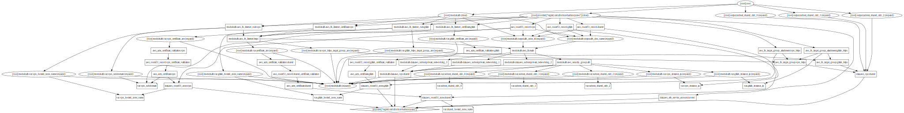

# Terraform-tt

## Plan



## Pre-requis

- [Terraform](https://www.terraform.io/downloads.html)
- [AWS CLI](https://docs.aws.amazon.com/cli/latest/userguide/install-cliv2.html)
- [nodejs](https://nodejs.org/en/download/)

## Installation

```bash
npm install
terraform init
```

## Utilisation

```bash
terraform plan
terraform apply
```

## Nettoyage

```bash
terraform destroy
```
